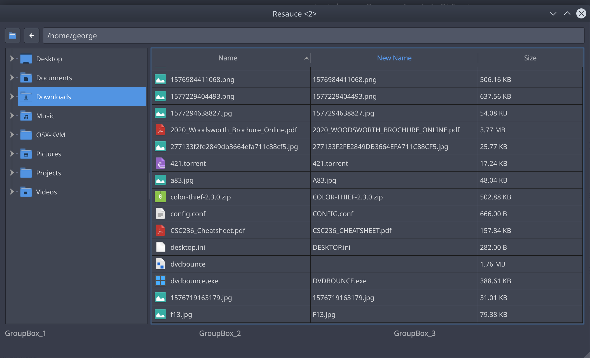

# Resauce

Resauce is a cross-platform tool that enables bulk file renaming based on sets of rules.

## Usage

You begin by selecting a root folder to operate on, then

Resauce works in three discrete parts:
- Filters
  - These are rules used to define which files to operate on and allow you to specifically include or exclude files based on certain rules, currently available predicates include:
    - Regex
    - Filename ends-with
    - Filename starts-with
    - File extension
    - etc
- Extractors
  - These extract information from file names which can be inserted into the new filenames, think extracting an episode or season number from the filename of a tv show file for example
  - Will be done through regex named capture groups
- Variables
  - Integer and floating point variables can be defined which increment or decrement at user defined intervals by user defined amounts, these values can be inserted into the new filename using the template
- Template
  - The template defines the output format for the new filenames, this can make use of extracted data from the *Extractors* and add literal text
